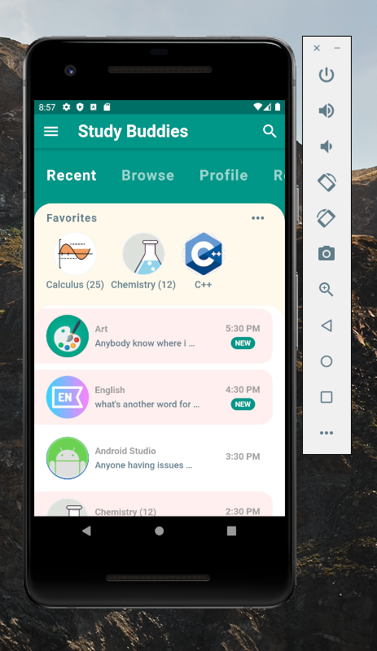

# online_we_work_homepage
* This project is the homepage for our online wework phone application.
* This code was created and run using Flutter on Android Studio.

## Requirements
* Any IDE with Flutter SDK installed.

## ScreenShots 📸

## Notes
This was my first time working with Android Studio and Dart. 
It was overwhelming at first, but I was able to learn a lot about the Dart language and its similarities to Java. 
Learned how to use widgets and provide some degree of functionality.
Towards the end I was able to send up a clickable to lead to another dart file, which was very exciting!
